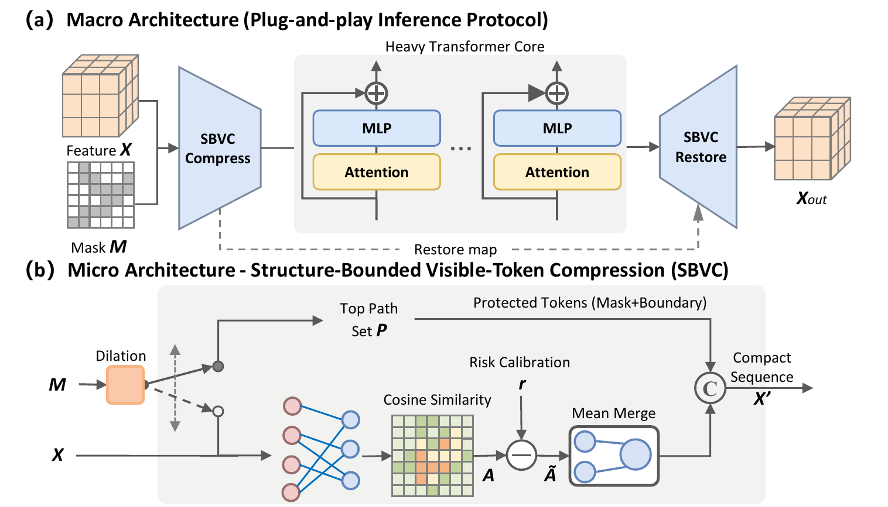
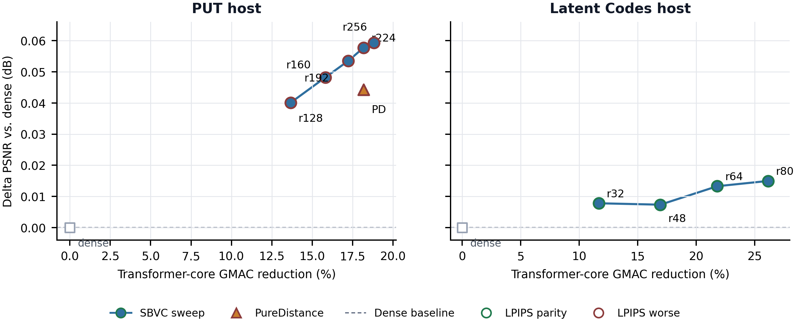
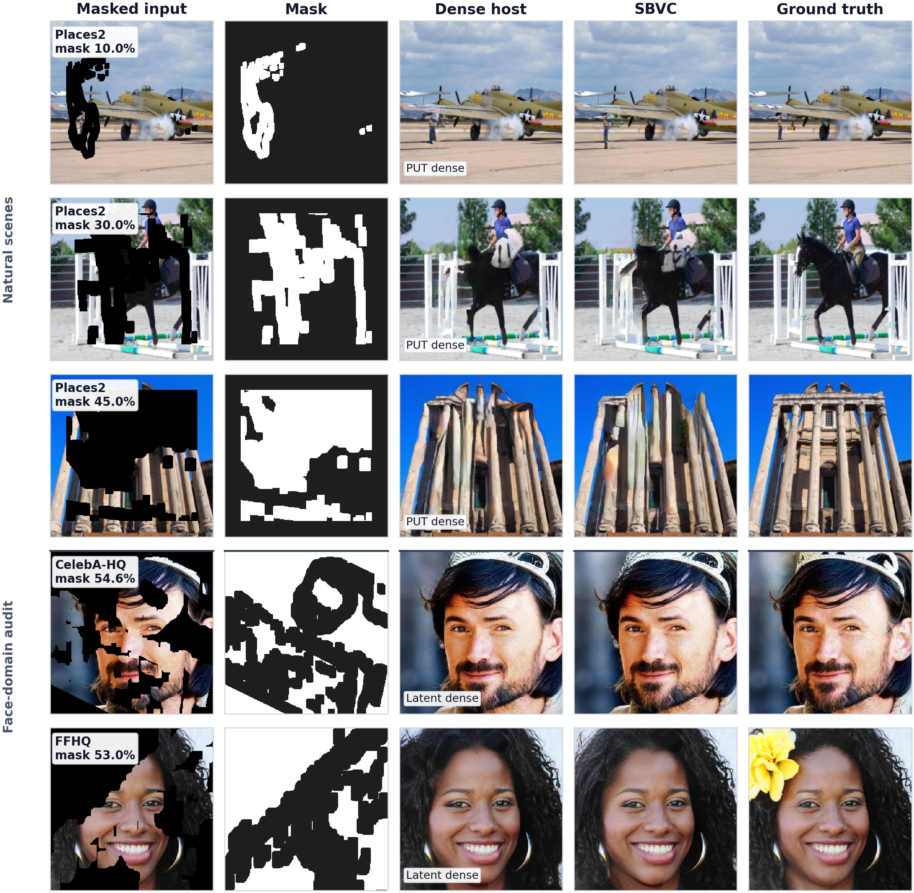

# SBVC

Official implementation of **SBVC: Plug-and-Play Structure-Bounded
Visible-Token Compression for Transformer-Based Image Inpainting**.

SBVC compresses only visible tokens that are separated from the inpainting
mask boundary. Protected tokens remain unchanged, eligible tokens are merged
inside the Transformer core, and the compact sequence is restored to the
original topology before decoding. The repository contains the two paper
backbones:

- PUT with risk-calibrated eligible-token matching.
- Latent Codes with late-layer QKV compression and a cached route.

The method is training-free for the reported pretrained checkpoints.



## Main Results

The table reports the principal operating point for each host on the fixed
36,500-image Places2/NaturalScene protocol.

| Backbone | Method | Setting | PSNR | SSIM | LPIPS | Core GMACs/image | GMAC reduction | Realized CR |
|---|---|---|---:|---:|---:|---:|---:|---:|
| PUT | Dense | - | 25.3055 | 0.8536 | 0.1490 | 2204.6158 | 0.00% | 0.0000 |
| PUT | SBVC | r224 | 25.3632 | 0.8530 | 0.1524 | 1803.7837 | 18.18% | 0.1762 |
| Latent Codes | Dense | - | 24.9776 | 0.8404 | 0.139211 | 16.8396 | 0.00% | 0.0000 |
| Latent Codes | SBVC | QKV-r64, layers 20-39 | 24.9909 | 0.8404 | 0.139209 | 13.1685 | 21.80% | 0.1245 |

Machine-readable values are in
[`results/paper_main_results.csv`](results/paper_main_results.csv).



## Qualitative Results

The original `media/main.gif` in this repository belonged to the upstream
Latent Codes project. The figure below is the actual SBVC comparison used by
the manuscript.



## Repository Layout

```text
.
|-- assets/                         # Paper figures used by this README
|-- docs/                           # Installation, reproduction, provenance
|-- results/                        # Machine-readable paper results
|-- scripts/                        # Reproduction launchers
|-- third_party/
|   |-- PUT/                        # PUT host with the SBVC integration
|   `-- baselines/
|       `-- latent-code-inpainting/ # Latent Codes host with SBVC integration
`-- tools/                          # Evaluation and route-analysis utilities
```

## Installation

The paper experiments used Python 3.10.19, PyTorch 2.9.0+cu128, torchvision
0.24.0+cu128, and an NVIDIA RTX 5090. The two upstream hosts have additional
legacy dependencies, so a clean Conda environment is recommended. Use the root
`requirements-runtime.txt`; the dependency files inside `third_party/` are
retained for provenance and target obsolete host environments.

See [`docs/INSTALL.md`](docs/INSTALL.md) for host-specific setup and checkpoint
placement, including installation on an offline compute node.

## Quick Start

All private machine paths were removed from the launchers. Set the required
paths explicitly:

```bash
export PYTHON_BIN="$(command -v python)"
export PUT_CHECKPOINT=/path/to/put/checkpoint.pth
export SBVC_IMAGE_ROOT=/path/to/places365/val_large
export SBVC_MASK_ROOT=/path/to/testing_mask_dataset
```

Run a PUT sanity evaluation:

```bash
PYTHONPATH="$PWD/tools:$PWD/third_party/PUT" \
"$PYTHON_BIN" tools/evaluate_put.py \
  --put-root "$PWD/third_party/PUT" \
  --checkpoint "$PUT_CHECKPOINT" \
  --image-root "$SBVC_IMAGE_ROOT" \
  --mask-root "$SBVC_MASK_ROOT" \
  --output-dir runs/put_sanity \
  --dataset-name "Places2/NaturalScene sanity" \
  --samples-per-bucket 2
```

Run Latent Codes with the paper operating point:

```bash
bash scripts/launch_latent_codes_sbvc_rebinned36500_full.sh
```

The complete protocol and expected manifest layout are documented in
[`docs/REPRODUCE.md`](docs/REPRODUCE.md).

## Paper Configurations

### PUT

```bash
PUT_BOUNDARY_SPLIT=1
PUT_SAFE_TOME_R=224
PUT_SAFE_TOME_SCORE_MODE=ga_spg_lite
PUT_GA_SPG_LITE_LAMBDA=0.20
PUT_GA_SPG_LITE_W_TEXTURE=0.45
PUT_GA_SPG_LITE_W_BOUNDARY=0.35
PUT_GA_SPG_LITE_W_SMOOTHNESS=0.20
PUT_GA_SPG_LITE_PAD_MODE=zero
PUT_GA_SPG_LITE_OPTIMIZED=1
```

### Latent Codes

```bash
LATENT_SBVC_ENABLE=1
LATENT_SBVC_R=64
LATENT_SBVC_MODE=qkv
LATENT_SBVC_ROUTE_MODE=safe_similarity
LATENT_SBVC_LAYER_IDS=20-39
LATENT_SBVC_ROUTE_CACHE=1
```

`LATENT_SBVC_ROUTE_MODE` also accepts `safe_distance` and
`global_similarity` for the matched mechanism controls reported in the paper.
The PUT ablations use `PUT_BOUNDARY_RING_RADIUS=0` and
`PUT_ABLATE_VALID_TOKEN_RESTRICTION=1`, respectively.

## Checkpoints and Data

Weights, datasets, generated images, and full evaluation outputs are not
committed. Download PUT and Latent Codes checkpoints from their official
projects, then place or link them as described in `docs/INSTALL.md`.

## Citation

```bibtex
@misc{wang2026sbvc,
  title  = {SBVC: Plug-and-Play Structure-Bounded Visible-Token Compression
            for Transformer-Based Image Inpainting},
  author = {Kehan Wang and Hong Peng and Weifa Zheng and Guosheng Lan and Ying Yu},
  year   = {2026},
  note   = {Manuscript under review}
}
```

## Acknowledgments

This implementation builds on
[PUT](https://github.com/liuqk3/PUT),
[Latent Codes](https://github.com/nintendops/latent-code-inpainting), and
[Token Merging](https://github.com/facebookresearch/ToMe).
See [`THIRD_PARTY_NOTICES.md`](THIRD_PARTY_NOTICES.md) for source and license
details.

## License

Third-party components retain their original licenses. A repository-wide
license for the SBVC modifications has not yet been granted; see
[`LICENSE.md`](LICENSE.md).
