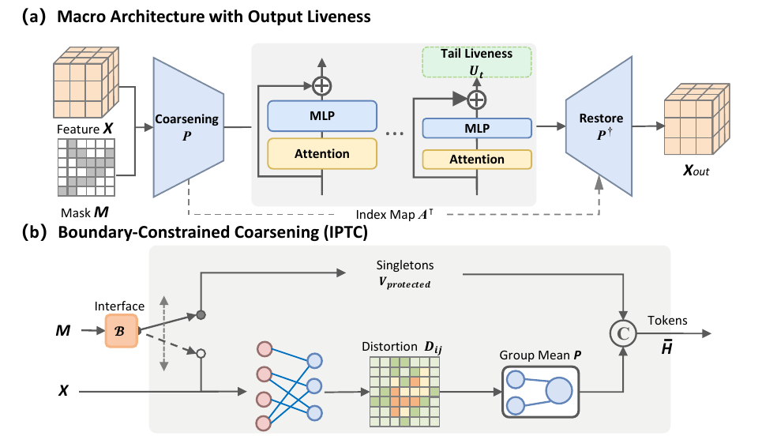

# IPTC

Reference implementation and aggregate benchmark results for:

> **Compress the Context, Preserve the Interface: Efficient Transformer Inpainting through Interface-Preserving Token Coarsening**

IPTC is an inference-time overlay for the PUT Transformer inpainting model. It
preserves singleton tokens at the known-side mask interface, coarsens eligible
background tokens, reconstructs the original grid through the retained group
map, and prunes output rows whose downstream consumers are inactive. The
release contains the evaluated inference path and does not redistribute model
weights or benchmark data.

## Project

**Authors:** Kehan Wang, Hong Peng, Weifa Zheng, Guosheng Lan, and Ying Yu.

The repository provides the core implementation, reported aggregates, source
provenance, and verification procedure for the IPTC project.

## Method overview



The overview shows the interface-preserving coarsening path, singleton
protection, grid reconstruction, and tail-block output liveness.

## Repository layout

```text
iptc/                         Core IPTC inference overlay
third_party/PUT/              PUT integration and upstream notices
results/iptc/                 Five-identity aggregate CSVs for Places and COCO
assets/                       Method and qualitative figures
tools/verify_iptc_release.py  Static release verification
docs/INSTALL.md               Environment and checkpoint notes
docs/REPRODUCE.md             Reproduction scope and measurement protocol
CITATION.cff                  Software citation metadata
THIRD_PARTY_NOTICES.md        Upstream attribution and license locations
```

## Main results

The table reports the dense PUT backbone and the complete IPTC protocol. The
measurements use FP32, batch size one, the NaturalScene 256 checkpoint, and a
single RTX 5090. Model loading, disk I/O, and metric computation are excluded
from the reported inference time.

| Collection | Method | RGB PSNR | LPIPS | Time (ms) | Peak allocated (MiB) |
|---|---|---:|---:|---:|---:|
| Places 1500 | PUT backbone | 25.066 | 0.14835 | 184.004 | 656.949 |
| Places 1500 | IPTC | **25.123** | 0.14877 | **148.405** | **560.550** |
| COCO 600 | PUT backbone | 23.779 | 0.15185 | 184.072 | 656.768 |
| COCO 600 | IPTC | **23.847** | 0.15236 | **148.093** | **560.677** |

The complete five-identity comparisons, including ToMe-SD, SiTo, and ToMA,
are available in [`results/iptc/`](results/iptc). IPTC reaches the dense
backbone quality range while providing the strongest fidelity at the tested
competitive operating point with comparable wall-clock latency. Results are
benchmark measurements for the stated protocol and should not be interpreted
as hardware-independent guarantees.

## Core implementation

- [`iptc/__init__.py`](iptc/__init__.py): public configuration and per-image context
- [`iptc/routing.py`](iptc/routing.py): interface-aware admissible grouping
- [`iptc/liveness.py`](iptc/liveness.py): route reuse and output liveness
- [`iptc/execution.py`](iptc/execution.py): compact execution path
- [`third_party/PUT/.../masked_image_inpainting_transformer.py`](third_party/PUT/image_synthesis/modeling/models/masked_image_inpainting_transformer.py): PUT integration point
- [`iptc/source_hashes.json`](iptc/source_hashes.json): provenance hashes for extracted sources

The implementation is a PUT overlay rather than a standalone image model. It
requires the official PUT runtime and NaturalScene 256 checkpoint. The public
configuration must be enabled before constructing the PUT model; an environment
variable alone does not activate the full protocol.

## Installation and quick start

See [`docs/INSTALL.md`](docs/INSTALL.md) for the recorded environment and
checkpoint requirements. The integration pattern is:

```python
import torch
from iptc import configure_environment, inference_context

configure_environment()
# model = load_the_official_put_checkpoint(...)
# batch = {"image": image, "mask": mask, "relative_path": "example.png"}

model.eval()
with torch.inference_mode(), inference_context(model, "example.png", seed=20260908):
    result = model.generate_content(
        batch=batch,
        filter_ratio=200,
        filter_type="count",
        replicate=1,
        with_process_bar=False,
        mask_low_to_high=False,
        sample_largest=True,
        calculate_acc_and_prob=False,
        num_token_per_iter=20,
        accumulate_time=None,
        raster_order=False,
    )
```

Use the same image/mask preprocessing as PUT and create a fresh inference
context for each image. For latency measurement, warm up the model and
synchronize CUDA around generation; do not measure while another GPU workload
is active.

## Verification

The release verifier performs a CPU-only static check of syntax, local module
dependencies, source hashes, and configuration. It does not require a
checkpoint and does not run inference:

```bash
python tools/verify_iptc_release.py
```

The public release does not include a turnkey frozen-dataset benchmark runner.
It includes the core inference overlay and aggregate results; the required
checkpoint, benchmark images, masks, manifests, and per-image outputs remain
outside the repository because of size, licensing, and access constraints.
See [`docs/REPRODUCE.md`](docs/REPRODUCE.md) for the exact scope and request
path for additional evaluation records.

## Data and model access

The evaluation uses images from a fixed Places365-derived collection and a
COCO collection under their respective access terms. The repository does not
redistribute either dataset, the PUT checkpoint, or generated image outputs.
The frozen evaluation manifests and additional per-image records can be
provided by the corresponding author for reproducibility checks, subject to
the relevant dataset terms.

## Attribution

IPTC builds on [PUT](https://github.com/liuqk3/PUT) and uses the bipartite
matching primitive associated with [ToMe](https://github.com/facebookresearch/ToMe).
Third-party code remains subject to its original license and attribution
requirements; see [`THIRD_PARTY_NOTICES.md`](THIRD_PARTY_NOTICES.md) and the
license files under `third_party/`.

Older SBVC launchers, results, and Latent Codes integrations remain in the
repository for provenance and compatibility. They are not part of the current
IPTC result path. No pretrained weights, credentials, private datasets, or
internal review materials are included.

## Citation

```bibtex
@software{wang2026iptc,
  author  = {Wang, Kehan and Peng, Hong and Zheng, Weifa and Lan, Guosheng and Yu, Ying},
  title   = {Compress the Context, Preserve the Interface: Efficient Transformer Inpainting through Interface-Preserving Token Coarsening},
  year    = {2026},
  url     = {https://github.com/khan-wang/IPTC}
}
```

The repository-wide license status and third-party notices are documented in
[`LICENSE.md`](LICENSE.md) and [`THIRD_PARTY_NOTICES.md`](THIRD_PARTY_NOTICES.md).


